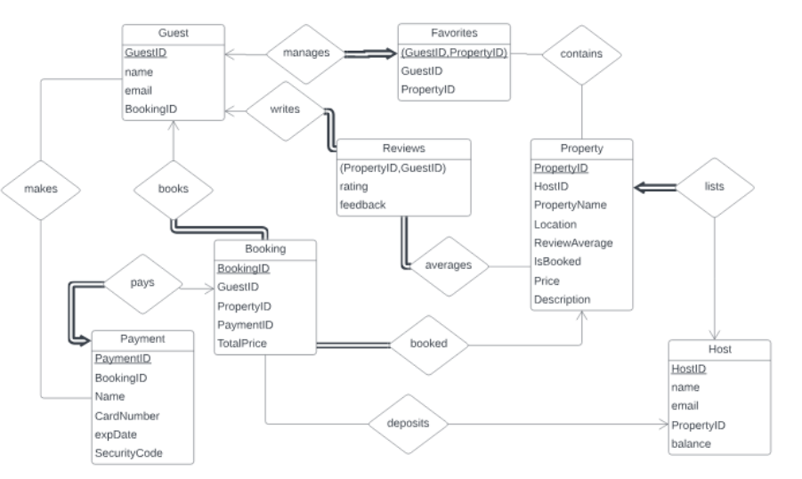

# *HouseRentals*

Created by: **Timothy Sims**

**A house rental application similar to Airbnb built using MySQL, Python, and the Python Streamlit library. Allows users to search for houses using a variety of filters, rent houses, and manage their rental properties.**

## ER Diagram

## License

    Copyright [2024] [Timothy Sims]

    Licensed under the Apache License, Version 2.0 (the "License");
    you may not use this file except in compliance with the License.
    You may obtain a copy of the License at

        http://www.apache.org/licenses/LICENSE-2.0

    Unless required by applicable law or agreed to in writing, software
    distributed under the License is distributed on an "AS IS" BASIS,
    WITHOUT WARRANTIES OR CONDITIONS OF ANY KIND, either express or implied.
    See the License for the specific language governing permissions and
    limitations under the License.